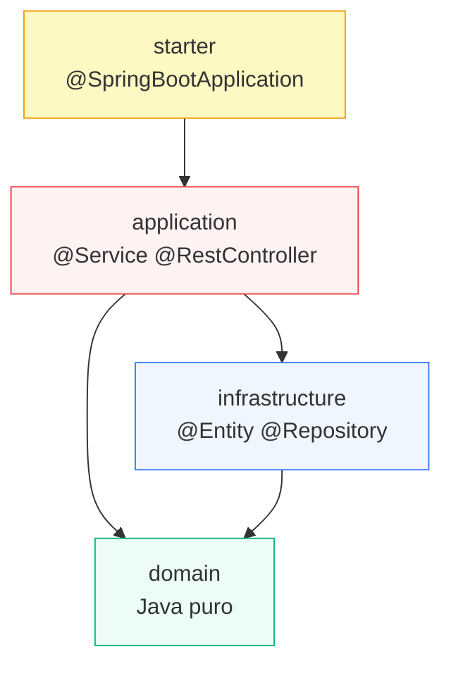

# Arquitetura

4 módulos Maven físicos. A fronteira é o `pom.xml` de cada um — não uma convenção de pasta que
alguém pode violar sem perceber.



## O que cada módulo pode depender

| Módulo | Pode depender de | Não pode ter |
|---|---|---|
| `domain` | nada (só JDK) | Spring, JPA, Lombok, qualquer framework/lib — **o `pom.xml` não tem essas dependências, então não compila mesmo se alguém tentar** |
| `infrastructure` | `domain` | regra de negócio — só tradução entity ↔ domain |
| `application` | `domain`, `infrastructure` | acesso direto a `infrastructure/entity` fora do próprio adapter |
| `starter` | `application` | qualquer classe de negócio — só `@SpringBootApplication` + `application.properties` |

## Records vs. Lombok

`domain/` usa `record` para modelos e `application/` usa `record` para DTOs — imutável, com
`equals`/`hashCode`/`toString` gerados pelo compilador, sem precisar de nenhuma dependência externa.
`infrastructure/entity/` usa Lombok (`@Getter @Setter @NoArgsConstructor @AllArgsConstructor
@Builder`) porque `@Entity` do JPA precisa de construtor sem args e se beneficia de campos
mutáveis — Lombok fica restrito a esse módulo.

## Dois tipos de "service"

```
domain/service/XxxLogic.java        sem @Service, sem @Transactional
                                     recebe ports por construtor (ou nenhuma dependência)
                                     contém a regra de negócio pura, testável sem Spring

application/service/XxxService.java @Service (+ @Transactional quando escreve)
                                     instancia XxxLogic direto (new) se ela não tem dependências,
                                     ou recebe via construtor se tiver
                                     não contém regra de negócio — só orquestra
```

Ver o exemplo completo em [Módulo de exemplo — produto](modulo-exemplo).

## Regra prática antes de criar um `domain/service/` novo

Nem todo módulo de negócio tem lógica pura de verdade — CRUD simples não tem nada a ganhar com
essa separação. Antes de extrair, pergunte: "existe uma regra aqui que não depende de banco, HTTP
ou tempo de relógio?" Se a resposta for não, o service fica só em `application/`, sem
contrapartida em `domain/service/`.
