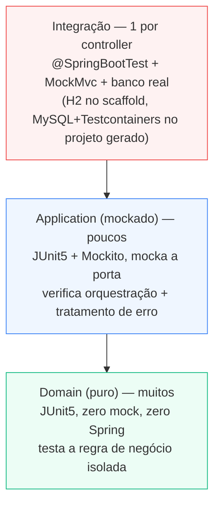

# Pirâmide de testes

3 níveis, cada um testando uma coisa diferente — não redundantes entre si.



## Base — domain, sem framework

`domain/src/test/java/.../ProdutoPrecoLogicUnitTest.java` — instancia a classe direto, sem mock,
sem contexto Spring. É o teste mais barato e mais rápido de rodar; deveria ser a maioria.

## Meio — application, um teste por use case

`application/src/test/java/.../usecase/` — um arquivo de teste por caso de uso, Mockito
(`@ExtendWith(MockitoExtension.class)`, `@Mock`) só na dependência direta:
`CadastrarProdutoUseCaseImplTest` mocka `ProdutoRepositoryPort`,
`CadastrarProdutoEmLoteUseCaseImplTest` mocka `CadastrarProdutoUseCase` (o use case vizinho que ele
injeta), não a porta. Cada teste isola exatamente a orquestração daquele caso de uso.

**Regra que existe por causa de um erro real visto num projeto de referência:** sempre chame o
método real do use case **primeiro**, e só **depois** verifique o mock e o valor retornado. Nunca
invoque o mock diretamente no corpo do teste como se fosse o código em teste — isso faz o teste
passar não importa o que o use case faça.

```java
// Errado — não testa nada de verdade
port.save(mockProduto);
verify(port, only()).save(mockProduto);
useCase.executar(dto);   // chamado depois, sem nenhuma asserção

// Certo — chama o use case, depois verifica o efeito
useCase.executar(dto);
verify(port).save(savedCaptor.capture());
assertEquals(0, expected.compareTo(savedCaptor.getValue().valorVenda()));
```

## Topo — integração, banco real

`starter/src/test/java/.../ProdutoControllerIntegrationTest.java` — `@SpringBootTest` +
`@AutoConfigureMockMvc`, sobe o contexto Spring inteiro com banco real (H2 no scaffold; MySQL via
Testcontainers no projeto gerado pelo skill de bootstrap). Prova que os 4 módulos Maven realmente
se conectam — é o único nível que teria pego o problema do projeto de referência (`genetic`), que
não builda fora da rede da empresa original por depender de uma lib privada.

Um teste de integração por controller basta. Casos de borda de regra de negócio vão no nível de
domain, não aqui.

De propósito essa classe de teste **não** tem `@Transactional` — se tivesse, o Spring TestContext
envolveria cada `@Test` numa transação só revertida no final do método, escondendo a diferença
entre "linha commitada" e "linha revertida" no meio do teste (que é exatamente o que `pci3_...`
precisa observar — ver abaixo). A limpeza entre testes é feita manualmente, por um `@BeforeEach` que
chama `produtoJpaRepository.deleteAll()`.

### pci3 — prova de rollback real

`pci3_loteComItemInvalidoNoFinalNaoDeixaNenhumProdutoSalvo` chama `POST /produto/lote` com 3 itens
(2 válidos + 1 com margem inválida) e depois um `GET /produto` simples. Se o rollback do
`@Transactional` em `CadastrarProdutoEmLoteUseCaseImpl.executar()` funcionar, a lista volta vazia —
nenhum dos 2 itens válidos fica salvo, mesmo já tendo passado por `port.save()` antes do item
inválido estourar a exceção. Ver a explicação completa do mecanismo em
[Módulo de exemplo — produto](modulo-exemplo#transação-e-rollback-cadastrarprodutoemloteusecase).

Esse é o único nível da pirâmide que pode provar rollback de verdade: um teste com mock na porta
(nível 2) só provaria que `port.save()` parou de ser chamado, não que o que já tinha sido chamado
foi desfeito — rollback é uma propriedade da transação real, não do código Java em si.

## Cobertura (JaCoCo)

`mvn test` já gera relatório de cobertura por módulo — não precisa esperar chegar na pipeline pra
descobrir que caiu. De propósito **não há gate de falha configurado** (`jacoco:check` com mínimo)
— cada módulo tem um perfil de cobertura esperado diferente (`domain/` deveria ficar perto de
100%; `infrastructure/adapter` é mais difícil de cobrir sem duplicar o teste de integração), então
um número único de corte serviria mal para os dois.

### Gerando e abrindo o relatório

```bash
mvn test                                          # roda os testes de todos os módulos e já gera o relatório de cada um

open domain/target/site/jacoco/index.html         # macOS -- troque "open" por "xdg-open" no Linux
open application/target/site/jacoco/index.html
open infrastructure/target/site/jacoco/index.html
open starter/target/site/jacoco/index.html
```

Cada `index.html` é a página inicial daquele módulo — lista os pacotes, e clicando num pacote você
chega na classe, e na classe chega na visão linha a linha (verde = coberta, vermelho = não
coberta, amarelo = branch parcialmente coberto). Não existe um relatório único agregando os 4
módulos — são 4 relatórios separados, um por `target/site/jacoco/` (dá pra consolidar depois com o
goal `report-aggregate` do próprio plugin, não configurado hoje).

Rodar só um módulo (mais rápido, útil ao iterar num só): `domain/` não depende de nenhum outro
módulo, então `mvn test -pl domain` sozinho já funciona. Os outros dependem de módulos irmãos —
use `-am` pra garantir que eles estejam compilados e instalados antes: `mvn test -pl application -am`.

**Leia com ressalva o número de `domain/model`:** `Produto` é um `record` — o compilador Java
gera `equals()`/`hashCode()`/`toString()`/os acessores automaticamente, e esses métodos raramente
são exercitados diretamente pelos testes (não asserimos `produto1.equals(produto2)` em lugar
nenhum). Isso derruba o percentual de `domain/model` sem significar nada sobre a qualidade dos
testes — o que importa de verdade é `domain/service` (a regra pura, `ProdutoPrecoLogic`), que fica
em 100% neste scaffold. Ao ler um relatório de cobertura, olhe `domain/service` e
`application/usecase` antes de `domain/model`.
